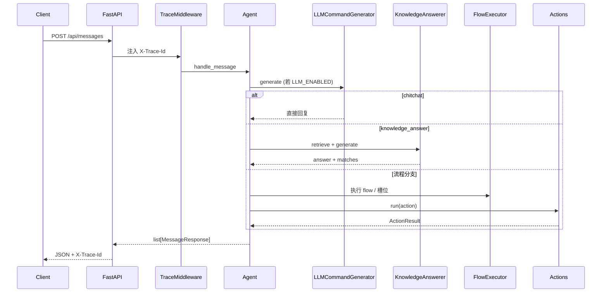

# 架构说明（customer_hand）

本文描述当前仓库内 **customer_hand** 的分层职责、请求链路以及与 `DEVELOPMENT_PLAN.md` 中「简历级智能客服」主线的对应关系。

## 1. 设计目标

- **可讲解**：从 HTTP 入口到 Agent、Flow、RAG 的路径清晰。
- **可测试**：核心链路有 pytest 覆盖。
- **可演进**：LLM 关闭时仍能走规则与流程；LLM 开启时输出受约束的结构化命令。

## 2. 逻辑分层

| 层级 | 目录 / 模块 | 职责 |
|------|----------------|------|
| API | `main.py`、`app/api/` | 路由、请求体验证、响应模型、异常处理、调试页 `/inspect` |
| 编排 | `app/agent/agent.py` | 消息主流程：记录用户消息 → LLM 命令 / RAG / 规则理解 → Flow 槽位 → Action |
| 对话与命令 | `app/dialogue/` | LLM 命令生成、解析、Flow 执行 |
| 动作 | `app/actions/` | 可注册业务动作（内置售后、物流等） |
| 会话与配置 | `app/core/`、`app/settings.py` | Tracker 内存存储、Flow YAML 加载、日志、trace、领域异常 |
| LLM | `app/llm/` | OpenAI 兼容客户端、命令类 Prompt 构建 |
| RAG | `app/rag/` | 文档加载、切分、**关键词索引**检索、带引用的回答生成 |
| 观测 | `app/core/trace.py`、`app/utils/telemetry.py` | `trace_id`、LLM/RAG 事件埋点 |

## 3. 请求生命周期（简图）

## 4. 核心数据流

1. **MessageRequest**（`sender_id` + `message`）进入 `POST /api/messages`。
2. **InMemoryTrackerStore** 按 `sender_id` 获取或创建 tracker，写入用户消息与事件。
3. **LLM 路径**（可选）：`LLMCommandGenerator` 使用 `CommandPromptBuilder` 生成 system/user prompt，模型返回 JSON 命令列表；解析后可能触发闲聊直接返回、或标记 `knowledge_answer` 走 RAG。
4. **规则路径**：无有效 LLM 或未处理时，`_apply_rule_understanding` 结合当前 Flow 状态决定下一步 Action。
5. **响应**：统一为 `MessageResponse` 列表，`metadata` 中可携带 `source`（如 `rag`、`llm`）、`matches` 等便于调试与面试演示。

## 5. 与开发计划的映射

| DEVELOPMENT_PLAN 能力 | 当前实现要点 |
|------------------------|----------------|
| P0 可运行骨架 | FastAPI、`/health`、统一 schema、`.env` |
| P1 Prompt / 多轮 / 意图 | 命令式 Prompt + tracker 历史摘要；规则 + LLM 双路径 |
| P1 RAG | 关键词检索 MVP + 可选 LLM 归纳（非向量库） |
| P1 日志与 trace | `configure_logging`、`emit_*_event`、`X-Trace-Id` |
| P1 异常 | `AppError` 统一 JSON，`trace_id` 回传 |

## 6. 已知局限（面试时可主动说明）

- Tracker 为**内存**存储，进程重启会丢失；生产环境需 Redis / DB。
- RAG 当前为 **SimpleKeywordIndex**，便于本地零依赖演示；与「向量库 + embedding」方案相比，语义召回能力有限。
- 未在本文档展开 Docker / 流式输出；若已在本分支实现，可在 README 中补充链接。

## 7. 推荐阅读顺序

1. `README.md` — 运行与 API 速览  
2. `docs/prompt.md` — 命令生成与约束  
3. `docs/rag.md` — 检索与生成链路  
4. `docs/interview_qna.md` — 高频追问与答法  
