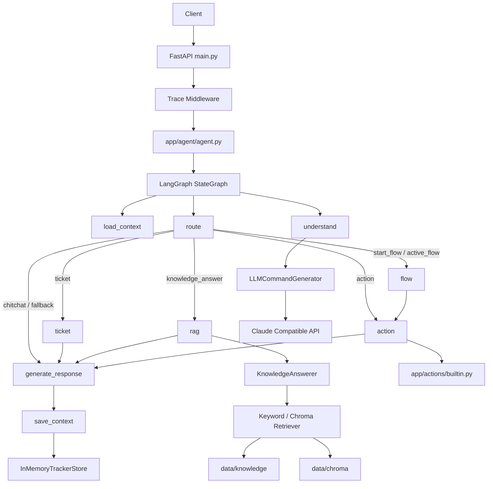
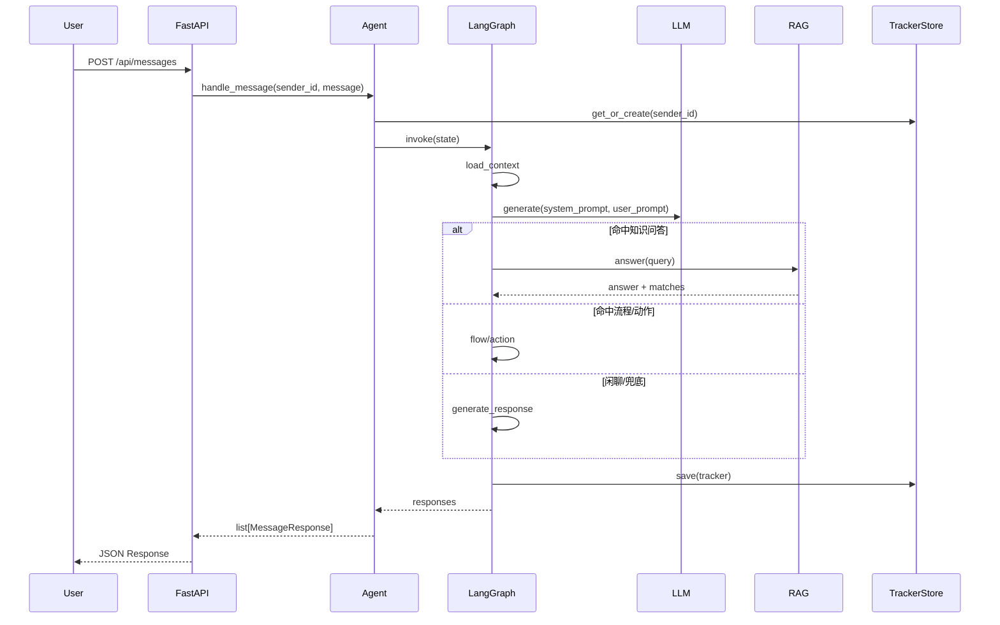

# customer_hand 项目分析（简历 / 面试版）

> 说明：本文仅基于当前仓库源码、配置、文档与测试文件整理；凡源码未体现之处，均明确标注“源码中未体现，建议补充”。

---

## 一、项目整体理解

### 这个项目是做什么的？

这是一个面向电商客服场景的 **LLM 智能客服后端**，核心能力包括：

- 接收用户消息并维护会话状态
- 通过 LangGraph 编排 Agent 主流程
- 通过 LLM 生成结构化 JSON 命令，驱动售后 / 物流 / 闲聊 / 知识问答 / 工单分支
- 支持知识库检索回答（关键词检索 + 可选 Chroma 向量检索）
- 支持内置 Action 执行业务回复
- 支持统一 trace、日志与异常处理

证据：

- `README.md`
- `main.py`
- `app/agent/agent.py`
- `app/agent/graph/builder.py`
- `app/agent/graph/nodes.py`
- `app/dialogue/llm_generator.py`
- `app/rag/answerer.py`
- `app/tickets/service.py`

### 面向什么业务场景？

源码中体现的是 **电商客服 / 智能客服 / 售后客服** 场景，尤其是：

- 退货 / 退款 / 售后申请
- 物流查询
- 知识库问答，如“退货规则”“退款多久到账”
- 人工客服转接 / 工单生成

证据：

- `app/llm/prompts.py`
- `data/flows/flow_postsale.yml`
- `data/flows/flow_logistics.yml`
- `app/tickets/router.py`
- `app/tickets/summary.py`

### 输入是什么？

输入主要是 HTTP 请求里的用户消息：

- `POST /api/messages`
- 请求体：`sender_id`、`message`

证据：

- `app/api/schemas.py`
- `main.py`

### 输出是什么？

输出是一个 `list[MessageResponse]`，包含：

- `recipient_id`
- `text`
- `timestamp`
- `metadata`

证据：

- `app/api/schemas.py`
- `main.py`

### 用户使用流程是什么？

1. 用户通过 `POST /api/messages` 发消息
2. API 层校验输入、生成 / 透传 `trace_id`
3. Agent 从内存会话仓库中取出或创建 tracker
4. LangGraph 进入 `load_context -> understand -> route`
5. 根据路由进入：
  - `ticket`
  - `rag`
  - `flow`
  - `action`
  - `chitchat`
  - `fallback`
6. 输出统一响应列表
7. 同时保存 tracker 上下文

证据：

- `main.py`
- `app/agent/graph/builder.py`
- `app/agent/graph/nodes.py`
- `app/core/tracker_store.py`

### 项目一句话介绍

> 基于 FastAPI + LangGraph 实现的电商智能客服后端，支持 LLM 结构化命令驱动、多轮会话、售后 / 物流流程编排、知识库检索和工单转接，并提供统一 trace、日志与异常处理。

---

## 二、项目技术栈

### 后端框架

- FastAPI
- Uvicorn

证据：

- `main.py`
- `requirements.txt`

### 大模型调用方式

源码中使用的是 OpenAI 兼容接口调用大模型，支持：

- `DASHSCOPE_API_KEY` / `BAILIAN_API_KEY` / `OPENAI_API_KEY`
- `DASHSCOPE_BASE_URL` / `BAILIAN_BASE_URL`
- `QWEN_MODEL` / `BAILIAN_MODEL`
- `LLM_ENABLED=false` 时不调用模型，走规则 / 流程兜底

证据：

- `app/llm/client.py`
- `app/dialogue/llm_generator.py`
- `app/settings.py`
- `README.md`

### Prompt 设计

Prompt 分为两层：

- system prompt：限制模型只能输出 JSON，并限定命令类型
- user prompt：注入会话状态、历史消息、flows、tools 和 schema

证据：

- `app/llm/prompts.py`

### RAG / 向量库 / Embedding 是否存在

存在，且支持两种检索后端：

1. **关键词检索**
  - 内存倒排索引
  - `SimpleKeywordIndex`
2. **向量检索**
  - ChromaDB
  - embedding
  - 阈值过滤

证据：

- `app/rag/retriever.py`
- `app/rag/vector_retriever.py`
- `app/rag/vector_store.py`
- `app/rag/embedding.py`
- `app/settings.py`

### 数据库或文件存储

当前源码体现的持久化方式：

- Tracker：内存存储
- 知识文件：本地文件（`data/knowledge/`）
- Flow 文件：本地 YAML（`data/flows/`）
- 向量索引：Chroma 持久化目录（`data/chroma/`）

源码中 **未体现关系型数据库接入**，建议补充。生产场景建议引入 Redis / PostgreSQL / MySQL。

证据：

- `app/core/tracker_store.py`
- `app/rag/vector_store.py`
- `app/rag/documents.py`
- `app/core/flow_loader.py`

### 前端或交互方式

源码中未体现传统前端 SPA，仅体现：

- HTTP API
- Swagger `/docs`
- 调试页 `/inspect`

证据：

- `main.py`
- `README.md`
- `app/api/templates/inspect.html`

### 部署方式

- 本地：`uvicorn main:app --reload` / `python main.py`
- Docker：`Dockerfile`、`docker-compose.yml`

证据：

- `README.md`
- `Dockerfile`
- `docker-compose.yml`

### 配置管理方式

- `.env` + `.env.example`
- `pydantic-settings`
- `app/settings.py` 中有默认值和路径归一化

证据：

- `app/settings.py`
- `.env.example`
- `README.md`

---

## 三、项目架构分析

### 目录结构说明

- `main.py`：FastAPI 入口、路由、中间件
- `app/api/`：schema、异常处理、调试模板
- `app/agent/`：Agent 主体、LangGraph 编排
- `app/dialogue/`：LLM 命令生成、命令解析
- `app/llm/`：LLM 客户端、Prompt 构建
- `app/rag/`：文档加载、切分、检索、回答、向量存储
- `app/core/`：tracker、flow loader、trace、日志、异常
- `app/actions/`：Action 抽象、注册、内置动作
- `app/tickets/`：工单、摘要、分类、转人工判断
- `data/`：flows、knowledge、chroma
- `test/`：pytest 测试

证据：

- `README.md`
- `docs/architecture.md`

### 核心模块职责

- `main.py`：统一对外 API 入口
- `app/agent/agent.py`：组装依赖、调用主流程
- `app/agent/graph/builder.py`：构建 LangGraph 状态图
- `app/agent/graph/nodes.py`：实现各业务节点
- `app/dialogue/llm_generator.py`：LLM 生成结构化命令
- `app/rag/answerer.py`：检索增强回答
- `app/tickets/service.py`：工单与人工转接
- `app/core/tracker_store.py`：会话存储
- `app/actions/builtin.py`：内置动作

### 主流程调用链

`POST /api/messages`
→ `main.py`
→ `Agent.handle_message()`
→ `run_agent_graph()`
→ `load_context`
→ `understand`
→ `route`
→ 分支（`ticket` / `rag` / `flow` / `action` / `generate_response`）
→ `save_context`
→ 返回 `MessageResponse[]`

### Mermaid 架构图

### Mermaid 请求时序图

---

## 四、核心业务流程

### 用户请求从哪里进入

从 `POST /api/messages` 进入。

证据：`main.py`、`app/api/schemas.py`

### 请求如何被处理

1. `main.py` 校验 message 非空
2. `run_with_trace()` 包装调用
3. `agent.handle_message()`
4. Agent 取出 / 创建 tracker
5. 构建 state 进入 LangGraph
6. 执行节点并路由
7. 返回统一响应列表

证据：

- `main.py`
- `app/agent/agent.py`
- `app/agent/graph/builder.py`
- `app/agent/graph/nodes.py`

### 是否调用大模型

会调用，但受 `LLM_ENABLED` 控制。

- `LLM_ENABLED=false`：不调用模型
- `LLM_ENABLED=true`：调用 OpenAI 兼容接口

证据：

- `app/llm/client.py`
- `app/dialogue/llm_generator.py`
- `app/settings.py`

### Prompt 如何构造

- system prompt：只能输出 JSON，限定命令类型
- user prompt：用户输入 + 会话状态 + flows + tools + schema

证据：

- `app/llm/prompts.py`

### 是否有知识库检索

有：

- 先检索知识片段
- 再把知识片段交给模型生成回答
- 返回 `answer + matches`

证据：

- `app/rag/answerer.py`
- `app/rag/retriever.py`

### 是否有上下文管理

有：

- `DialogueStateTracker` 保存 slots、events、active_flow、slot_to_collect 等状态
- `load_context` 写入用户消息
- `generate_response` 写入 bot 消息
- `save_context` 保存 tracker

证据：

- `app/core/tracker.py`
- `app/agent/graph/nodes.py`
- `app/core/tracker_store.py`

### 最终结果如何返回

统一封装成 `MessageResponse` 列表返回。

证据：

- `main.py`
- `app/api/schemas.py`

---

## 五、简历写法

### 1）简洁版

**项目名称**：电商智能客服后端

**项目背景**：基于 FastAPI 构建的 LLM 智能客服系统，支持售后、物流查询、知识问答和人工工单转接。

**技术栈**：FastAPI、LangGraph、Claude Compatible API、ChromaDB、PyYAML、pytest

**我的职责**：负责对话编排、LLM 命令生成、RAG 检索、会话状态管理和接口设计。

**亮点成果**：实现结构化 JSON 命令驱动的客服链路，并支持关键词 / 向量两种检索后端和统一 trace 追踪。

### 2）标准版

**项目名称**：电商场景 LLM 智能客服系统

**项目背景**：面向电商客服场景，构建一个支持售后、物流查询、知识问答和人工转接的轻量级智能客服后端。

**技术栈**：FastAPI、Uvicorn、LangGraph、Claude API 兼容调用、ChromaDB、pydantic-settings、PyYAML、pytest

**我的职责**：设计并实现 API 层、Agent 编排层、Prompt 约束层、知识检索层和会话追踪层。

**亮点成果**：

- 通过结构化 JSON 命令控制 LLM 输出，降低自由生成带来的不稳定性
- 构建可切换的 RAG 后端，支持关键词检索与向量检索
- 通过内存 tracker + flow YAML 实现多轮对话和售后 / 物流流程编排
- 实现统一 trace、错误响应和 Docker 启动，便于本地演示和面试展示

### 3）强化版

**项目名称**：LLM 驱动的电商智能客服平台

**项目背景**：针对电商客服高频场景，构建支持多轮对话、业务流程编排、知识问答、人工转接与可观测性的智能客服平台。

**技术栈**：FastAPI、LangGraph、Claude Compatible API、ChromaDB、Embedding、PyYAML、pytest、Docker、pydantic-settings

**我的职责**：主导对话编排架构设计，完成 Prompt 工程、RAG 检索链路、会话状态持久化方案、Action 注册机制及接口层联调。

**亮点成果**：

- 通过“LLM 结构化 JSON 命令”将自由对话转为可控工作流，降低幻觉和错误路由风险
- 通过“关键词检索 + 向量检索”双后端方案，兼顾演示可用性和语义召回能力
- 通过 tracker + flow + action 的分层设计，实现售后 / 物流等场景的多轮状态管理
- 通过 trace、日志、异常和 Docker 化部署，提升系统可维护性和本地演示效率

### 简历 bullet point

- 负责设计 `FastAPI + LangGraph` 的客服编排链路，串联会话状态、意图识别、流程控制与响应生成。
- 实现 LLM 结构化 JSON 命令生成与解析，支持售后、物流、知识问答和人工工单分支。
- 设计知识库检索模块，支持关键词检索与 Chroma 向量检索切换，并在响应中返回 `matches` 便于调试。
- 建立统一 `trace_id`、异常处理和结构化日志，提升请求链路可观测性。

### 可补充的量化指标建议

- 每日 / 每次请求平均延迟
- 关键词检索命中率
- RAG 回答成功率
- 测试覆盖率

---

## 六、项目难点分析

### 1）大模型调用稳定性

**难在哪里**：模型可能返回非 JSON、空输出、超时或调用失败，业务链路不能完全依赖 LLM。

**当前源码怎么处理**：

- `LLM_ENABLED=false` 时禁用模型调用
- `LLMClient.generate_json()` 捕获异常并返回结构化失败结果
- `LLMCommandGenerator.generate()` 对空输出、解析失败做降级
- `understand()` 节点捕获异常并返回空结果兜底

**目前不足**：没有重试、熔断、限流，也没有流式输出。

**面试回答思路**：把 LLM 当成“可失败能力”，用状态机兜底，失败时回落到规则、流程或人工工单。

### 2）Prompt 设计

**难在哪里**：既要理解业务，又要输出稳定结构化内容。

**当前源码怎么处理**：system prompt 约束只能输出 JSON；user prompt 注入会话状态、历史、flows、tools 和 schema。

**目前不足**：Prompt 规则硬编码，缺少版本化与自动化评测。

**面试回答思路**：system 负责协议，user 负责上下文；目标是让模型输出可解析、可路由。

### 3）RAG 检索准确率

**难在哪里**：关键词容易漏召回，向量检索可能误召回，Top-K 和阈值需要平衡。

**当前源码怎么处理**：支持 keyword / chroma 两种 backend，向量检索做阈值过滤，回答中返回 `matches`。

**目前不足**：没有 rerank、query rewrite 或召回评测。

**面试回答思路**：先做可用的 RAG MVP，再通过混合检索、rerank 和 query rewrite 提升召回质量。

### 4）多轮对话上下文

**难在哪里**：需要记住 active flow、slot、历史消息、最近操作。

**当前源码怎么处理**：tracker 保存 slots、events、active_flow、slot_to_collect 等状态。

**目前不足**：内存存储，不持久化，不支持并发安全。

**面试回答思路**：把上下文拆成结构化状态，适合流程型客服，也便于测试和调试。

### 5）幻觉控制

**难在哪里**：模型可能编造退货政策、物流状态等。

**当前源码怎么处理**：Prompt 明确要求不能编造；知识问答走“检索后回答”；流程 / 动作由规则控制；不确定时转人工。

**目前不足**：无答案校验和自动幻觉检测。

**面试回答思路**：把可控业务收敛到流程和动作，模型只做识别和路由。

### 6）响应延迟

**难在哪里**：LLM、embedding、RAG 都会增加耗时。

**当前源码怎么处理**：各模块有耗时埋点，`LLM_ENABLED=false` 可关闭模型。

**目前不足**：无缓存、无流式、无异步批处理。

**面试回答思路**：隔离慢操作并通过配置开关控制链路；生产可加入缓存和流式输出。

### 7）错误处理

**难在哪里**：输入错误、LLM 错误、RAG 错误、Action 错误都可能发生。

**当前源码怎么处理**：自定义异常、统一异常处理、节点内兜底。

**目前不足**：错误分类仍可细化，缺少告警闭环。

**面试回答思路**：把错误分成输入错误、业务错误、外部依赖错误三类处理。

### 8）配置安全

**难在哪里**：API Key、Base URL、模型名不能硬编码。

**当前源码怎么处理**：.env + pydantic-settings，日志中对敏感信息做 mask / sha8。

**目前不足**：仍依赖本地 `.env`。

**面试回答思路**：所有配置都通过环境变量注入，日志脱敏。

### 9）部署运维

**难在哪里**：本地和 Docker 环境要一致，数据目录要持久化。

**当前源码怎么处理**：Docker Compose + 路径 resolve + 数据卷挂载。

**目前不足**：没有 K8s / CI/CD / 多实例共享状态方案。

**面试回答思路**：这是轻量化演示架构，生产化需引入外部存储、健康检查和监控。

### 10）数据持久化

**难在哪里**：会话不能只放内存，工单也要持久化。

**当前源码怎么处理**：Tracker 内存、Chroma 持久化、工单内存存储。

**目前不足**：重启丢失、无数据库事务能力。

**面试回答思路**：演示架构先跑通链路，生产必须迁移到 Redis / 数据库。

### 11）可扩展性

**难在哪里**：新增业务流程、新动作、新知识源需要低耦合扩展。

**当前源码怎么处理**：Action 注册、YAML Flow、依赖注入。

**目前不足**：部分逻辑仍集中在 `nodes.py`。

**面试回答思路**：通过注册表、YAML 和依赖注入降低扩展成本。

---

## 七、项目如何评测

### 1）功能测试

- 指标：接口成功率、业务分支覆盖率、返回结构正确率
- 方法：pytest + HTTP API
- 用例：退货、物流、闲聊、空消息、非法 sender_id

### 2）Prompt 效果评测

- 指标：JSON 格式正确率、命令类型命中率、误路由率
- 方法：标准对话集对比模型输出
- 用例：
  - “我要退货” → `start_flow(postsale)`
  - “退货规则是什么” → `knowledge_answer`
  - “你好” → `chitchat`

### 3）RAG 检索评测

- 指标：Recall@K、Precision@K、MRR、命中率
- 方法：构造问题-标准知识片段对
- 用例：退货多久到账、怎么退款、物流多久到

### 4）大模型回答质量评测

- 指标：正确性、完整性、简洁性、幻觉率、引用一致性
- 方法：人工抽检 + 标准答案对比

### 5）延迟评测

- 指标：P50 / P95 / P99、LLM 耗时、RAG 耗时、embedding 耗时
- 方法：压测 + 日志中的 `latency_ms`

### 6）稳定性评测

- 指标：错误率、降级成功率、恢复时间
- 方法：模拟 LLM 失败、空知识库、embedding 失败

### 7）异常输入测试

- 指标：输入校验覆盖率、错误分类正确率
- 方法：空消息、超长消息、非法 sender_id

### 8）成本评估

- 指标：单次 token 成本、RAG 成本、embedding 成本
- 方法：统计 `usage` 字段

### 9）用户体验评测

- 指标：首答时间、问题解决率、转人工率、重复追问率
- 方法：真实对话日志抽样

### 简历可写法

- 搭建 pytest 测试体系，覆盖消息入口、会话追踪、RAG 检索和异常响应等核心链路。
- 设计客服场景评测集，从功能、检索和回答质量三个维度验证系统效果。

### 当前项目中建议补的测试

源码中已存在部分 `test/` 与脚本，但仍建议补：

- Prompt 结构化输出评测
- RAG Recall@K 评测
- 延迟基准测试
- 稳定性 / 降级测试
- 幻觉检测样例集

---

## 八、面试官可能会问的问题

### 基础问题

#### 1）项目是做什么的？

- 考察点：是否真正理解系统目标和业务场景
- 回答思路：强调电商客服、多轮对话、售后 / 物流 / 知识问答 / 工单
- 可背诵回答：这个项目是一个电商场景的智能客服后端，基于 FastAPI 和 LangGraph 实现……

#### 2）你负责哪部分？

- 考察点：个人贡献
- 回答思路：API、编排、Prompt、RAG、状态管理

#### 3）为什么这么设计？

- 考察点：架构思维、权衡能力
- 回答思路：LLM 不直接做所有事，用状态机 + 命令驱动

### 进阶问题

#### 4）Prompt 怎么设计？

- system 负责约束，user 负责上下文

#### 5）如何减少幻觉？

- 结构化输出、RAG、流程控制、人工转接

#### 6）如何提升回答准确率？

- 改进召回、rerank、query rewrite

#### 7）如何做上下文管理？

- tracker 保存结构化状态，不只存文本

#### 8）如何处理大模型 API 超时或失败？

- 降级、兜底、规则路径

#### 9）如何做流式输出？

- 源码中未体现，建议补 SSE/WebSocket

#### 10）如何评测效果？

- 功能、prompt、RAG、延迟、稳定性

### 高阶问题

#### 11）如果用户量变大怎么扩展？

- 外部化状态、缓存、异步、水平扩展

#### 12）如何降低 token 成本？

- 压缩上下文、减少无效调用、只传相关片段

#### 13）如何做 RAG 召回优化？

- chunk、混合召回、rerank、query rewrite

#### 14）如何做安全防护？

- 密钥管理、日志脱敏、输入校验、提示词注入防护

#### 15）如何上线到生产环境？

- 容器化、健康检查、监控、外部存储

#### 16）如果让你重构这个项目，你会怎么做？

- 拆分模块、外部化存储、补齐评测与监控

---

## 九、为了应对面试，需要掌握哪些内容

### 必须掌握

- Python 基础
- FastAPI 基础
- HTTP / RESTful API
- 环境变量和 `.env`
- 大模型 API 调用方式
- Prompt Engineering
- RAG 基础
- 会话状态管理
- 异常处理
- pytest 基础
- Docker 基础
- LangGraph / 状态机流程

### 最好掌握

- Claude compatible API
- ChromaDB / 向量检索
- Embedding 基础
- 多轮上下文设计
- 结构化输出 / JSON schema
- 日志与 trace
- 测试分层

### 加分掌握

- RAG 召回优化
- rerank / query rewrite
- 流式输出
- 缓存与限流
- 监控和可观测性
- 工单系统设计
- 生产部署与水平扩展

---

## 十、需要掌握哪些八股

### 1）Python 基础八股

- 默认参数为什么不要用可变对象
- `dict` / `list` 深浅拷贝区别
- `@dataclass` 的作用

结合本项目：项目中大量使用 `Field(default_factory=...)` 和 `dict(...)` 规避共享可变对象问题。

### 2）Web 后端八股

- 什么是无状态服务
- 为什么无状态适合扩展

结合本项目：tracker 当前是内存态，生产应外部化。

### 3）FastAPI 八股

- 为什么 FastAPI 适合 API 服务
- Pydantic 的作用

结合本项目：`MessageRequest`、`MessageResponse` 都是 Pydantic 模型。

### 4）Docker 八股

- 为什么要挂载数据目录
- 镜像和容器的区别

结合本项目：`./data` 挂载到容器内 `/app/data`。

### 5）HTTP / RESTful API 八股

- REST 的核心原则
- GET / POST 的区别

结合本项目：`GET /health`、`POST /api/messages` 等接口。

### 6）数据库八股

- 为什么内存存储不适合生产
- 持久化与事务

结合本项目：`InMemoryTrackerStore` 适合演示，生产需迁移。

### 7）大模型应用八股

- 为什么不能让模型自由生成所有业务结果
- 如何降低幻觉

结合本项目：通过 JSON 命令、流程和 RAG 把模型限制在可控范围。

### 8）RAG 八股

- RAG 的基本流程
- chunk、top-k、阈值、embedding

结合本项目：`app/rag/`* 正好对应文档加载、切分、检索、回答。

### 9）Prompt 八股

- system prompt 和 user prompt 的区别
- few-shot 和 zero-shot 的区别

结合本项目：system prompt 明确约束 JSON 输出，user prompt 注入状态。

### 10）向量数据库八股

- 向量检索为什么要阈值过滤
- 为什么向量索引需要持久化

结合本项目：`VectorKnowledgeRetriever` 使用 `score_threshold`。

### 11）部署运维八股

- 健康检查的作用
- 为什么容器化后仍要挂载数据

结合本项目：`GET /health` 和 Docker Compose 部署。

---

## 十一、项目短板和优化建议

### 1）工程结构

- 当前问题：状态管理、业务路由和节点逻辑仍集中在 `nodes.py`
- 源码证据：`app/agent/graph/nodes.py`
- 优化方案：拆分更细的节点服务，降低耦合
- 简历写法：优化 Agent 分层结构，提升业务扩展性和模块解耦程度

### 2）代码质量

- 当前问题：部分逻辑依赖运行时类型判断，结构上还偏轻量 Demo
- 源码证据：`app/core/tracker_store.py`、`app/agent/graph/nodes.py`
- 优化方案：引入更严格的数据模型与类型约束
- 简历写法：完善状态模型设计，降低运行时类型不确定性

### 3）配置安全

- 当前问题：仍依赖 `.env`
- 源码证据：`app/settings.py`、`.env.example`
- 优化方案：接入密钥管理服务与分环境配置
- 简历写法：建立环境变量驱动的配置管理机制，避免密钥硬编码

### 4）日志

- 当前问题：有日志和埋点，但未见统一日志平台接入
- 源码证据：`app/core/logging.py`、`app/utils/telemetry.py`、`app/core/trace.py`
- 优化方案：JSON 日志、集中式日志系统、业务 tag
- 简历写法：设计 trace + 结构化日志方案，提升链路排障效率

### 5）测试

- 当前问题：已有 pytest，但缺少系统化评测报告
- 源码证据：`test/`
- 优化方案：补充 prompt、RAG、延迟、稳定性测试
- 简历写法：构建 pytest 测试体系，覆盖接口、编排和检索核心链路

### 6）评测

- 当前问题：缺少标准化离线评测体系
- 源码证据：源码中未见独立 eval pipeline
- 优化方案：建立对话测试集，评测 Recall@K、幻觉率、延迟
- 简历写法：设计客服场景评测集，从功能、检索和回答质量三个维度验证系统效果

### 7）部署

- 当前问题：只有 Docker Compose 单服务示例
- 源码证据：`docker-compose.yml`、`Dockerfile`
- 优化方案：增加健康检查、滚动发布、外部存储和监控
- 简历写法：完成 Docker 化部署与数据卷挂载，支持本地和容器化演示

### 8）可观测性

- 当前问题：有 trace，但还没有完整监控告警闭环
- 源码证据：`app/core/trace.py`、`main.py`
- 优化方案：接入 Prometheus / Grafana 等监控
- 简历写法：为关键请求链路增加 `trace_id` 和 LLM / RAG 埋点

### 9）大模型效果

- 当前问题：Prompt 有约束，但没有自动化质量评估和 A/B 测试
- 源码证据：`app/llm/prompts.py`、`app/dialogue/llm_generator.py`
- 优化方案：Prompt 版本管理、few-shot 优化、自动化评测集
- 简历写法：通过结构化 Prompt 将模型输出约束为可解析业务命令

### 10）用户体验

- 当前问题：没有流式输出，用户需要等待完整响应
- 源码证据：源码中未体现流式接口
- 优化方案：SSE / WebSocket 流式返回
- 简历写法：当前版本支持稳定的同步响应，后续可扩展为流式交互提升体验

---

## 十二、最终输出

### 1）30 秒项目介绍

> 我做的是一个电商场景的智能客服后端，基于 FastAPI 和 LangGraph 实现。系统支持用户通过消息接口发起退货、物流查询、知识问答和人工工单，内部通过结构化 JSON Prompt 驱动 LLM，再结合会话状态、RAG 检索和内置动作完成路由和回复。项目还加了 trace、日志、异常处理和 Docker 化启动，比较适合作为大模型应用开发的简历项目。

### 2）1 分钟项目介绍

> 这个项目是一个面向电商客服场景的 LLM 智能客服后端。用户通过 `/api/messages` 发消息后，系统会先读取会话上下文，再通过 LangGraph 编排的 Agent 主流程处理：LLM 负责输出结构化 JSON 命令，比如 `start_flow`、`knowledge_answer`、`ticket`，然后根据命令进入售后流程、物流查询、知识库问答或人工转接。知识问答部分支持关键词检索和 Chroma 向量检索两种方式，同时返回 `matches` 方便追踪来源。整体上它把模型能力约束成可控业务流程，兼顾了可用性、可调试性和可扩展性。

### 3）3 分钟项目介绍

> 我这个项目是一个电商智能客服后端，目标是把大模型能力落到真实客服业务里，而不是做一个纯聊天机器人。前端或外部系统通过 FastAPI 的 `/api/messages` 接口传入 `sender_id` 和用户消息后，系统会先从内存 tracker 中恢复会话状态，再进入 LangGraph 编排的 Agent 流程。  
> 在理解阶段，LLM 不直接自由回复，而是通过结构化 Prompt 输出 JSON 命令，例如售后、物流会优先转成 `start_flow`，知识问答会转成 `knowledge_answer`，确实需要人工时才会进入 `ticket`。然后系统会根据命令进入对应分支：售后和物流走流程节点和内置 Action，知识问答先检索知识库再让模型基于片段回答，最后统一封装成标准响应返回。  
> 我在项目里重点做了几件事：第一是 Prompt 约束，把模型输出变成可解析、可路由的业务命令；第二是 RAG 检索，支持关键词检索和 Chroma 向量检索；第三是多轮会话状态管理，记录 active flow、slot、events 等上下文；第四是统一 trace、异常和日志，保证链路可调试。这个项目比较适合在面试里展示大模型应用的工程化能力，而不是只讲模型调用。

### 4）简历项目描述最终版

> 基于 FastAPI + LangGraph 设计并实现电商智能客服后端，支持售后、物流查询、知识问答和人工工单转接；通过结构化 JSON Prompt 驱动 LLM 进行意图路由，结合会话 tracker、YAML flow、Action 注册机制和 RAG 检索完成多轮客服编排；实现统一 trace、异常处理、日志埋点及 Docker 化启动，提升系统可维护性与可演示性。

### 5）面试前复习清单

- `main.py` 的接口和 middleware
- `app/agent/graph/builder.py` 的状态图
- `app/agent/graph/nodes.py` 的各节点
- `app/llm/prompts.py` 的 Prompt 规则
- `app/rag/retriever.py` 和 `app/rag/answerer.py`
- `app/core/tracker.py` 和 `app/core/tracker_store.py`
- `app/actions/builtin.py`
- `app/tickets/service.py`
- `README.md` 和 `docs/architecture.md`

### 6）最应该补的 5 个功能或优化点

1. 增加标准化评测体系
2. 将 tracker / ticket 持久化
3. 增加流式输出
4. 引入 query rewrite / rerank
5. 增加监控与可观测性

已按要求做了只读扫描和源码分析；本轮没有修改文件，也没有运行 pytest，避免产生缓存写入。

**一、项目真实性分析**

- 实际做什么：这是一个电商场景的 LLM 智能客服后端，提供消息接口、会话状态管理、售后/物流流程、知识库问答和人工工单转接。（依据：D:\code4\llm-universe-main\customer_simple\customer_hand\[main.py](http://main.py) / create_app、app\agent\[agent.py](http://agent.py) / Agent.handle_message、data\flows\flow_postsale.yml、data\flows\flow_logistics.yml）
- 业务场景：电商售后、退货退款、物流查询、店铺 FAQ、人工客服工单。（依据：D:\code4\llm-universe-main\customer_simple\customer_hand\data\knowledge\shop_[faq.md](http://faq.md)、app\llm\[prompts.py](http://prompts.py) / CommandPromptBuilder._build_system_prompt、app\tickets\[service.py](http://service.py)）
- 用户输入：POST /api/messages，请求体包含 sender_id 和 message。（依据：D:\code4\llm-universe-main\customer_simple\customer_hand\app\api\[schemas.py](http://schemas.py) / MessageRequest、[main.py](http://main.py) / send_message）
- 系统输出：返回 list[MessageResponse]，包含 recipient_id、text、timestamp、metadata；RAG 场景会带 matches 等元数据，工单场景会带 ticket_id。（依据：app\api\[schemas.py](http://schemas.py) / MessageResponse、app\agent\graph\[nodes.py](http://nodes.py) / generate_response、ticket、rag）
- 核心流程：main.py/send_message -> Agent.handle_message -> run_agent_graph -> load_context -> understand -> route -> rag/flow/action/ticket/fallback -> generate_response -> save_context。（依据：[main.py](http://main.py)、app\agent\[agent.py](http://agent.py)、app\agent\graph\[builder.py](http://builder.py)、app\agent\graph\[nodes.py](http://nodes.py)）
- 是否真的调用大模型：是，但受 LLM_ENABLED 控制；开启后通过 OpenAI SDK 的兼容接口调用 chat.completions.create，默认配置支持 DashScope/百炼/OpenAI key。（依据：app\llm\[client.py](http://client.py) / LLMClient.from_env、generate_json、.env.example）
- 是否真的有 Prompt：有，CommandPromptBuilder 明确要求模型输出结构化 JSON 命令，包括 start_flow、set_slot、knowledge_answer、ticket 等。（依据：app\llm\[prompts.py](http://prompts.py) / CommandPromptBuilder）
- 是否真的有 RAG/知识库/向量库：有。知识库加载 .md/.txt/.markdown，支持关键词检索和 Chroma 向量检索；向量检索通过 embedding API 生成向量并写入 Chroma。（依据：app\rag\[documents.py](http://documents.py)、app\rag\[retriever.py](http://retriever.py)、app\rag\vector_[store.py](http://store.py)、app\rag\[embedding.py](http://embedding.py)、app\rag\[reindex.py](http://reindex.py)）
- 是否有 FastAPI/Docker/pytest：有。FastAPI 入口在 [main.py](http://main.py)；Dockerfile 与 compose 存在；测试目录有 16 个测试文件、51 个 test_ 函数。（依据：[main.py](http://main.py)、Dockerfile、docker-compose.yml、test\*.py、pytest.ini）
- 可以安全写：FastAPI API、LangGraph 编排、结构化 JSON Prompt、OpenAI 兼容 LLM 调用、RAG、Chroma、Embedding、会话 Tracker、YAML Flow、Action 注册、工单转接、trace_id、Docker、pytest。
- 不建议写：生产级系统、真实物流 API 接入、Redis/MySQL/PostgreSQL 持久化、SSE/WebSocket 流式输出、rerank/query rewrite、权限认证、CI/CD、K8s、线上指标、用户增长或准确率数据。源码中未体现，不建议写进简历。

**二、项目技术栈**

后端框架：FastAPI、Uvicorn、Pydantic。（依据：D:\code4\llm-universe-main\customer_simple\customer_hand\[main.py](http://main.py)、app\api\[schemas.py](http://schemas.py)、requirements.txt）

大模型 API：OpenAI Python SDK 兼容接口，支持 DashScope/百炼/OpenAI 环境变量配置。（依据：app\llm\[client.py](http://client.py)、.env.example）

Prompt 设计：结构化 JSON 命令 Prompt，区分 system prompt 和 user prompt。（依据：app\llm\[prompts.py](http://prompts.py)）

RAG / 知识库：本地 Markdown/TXT 知识库、文档加载、chunk 切分、关键词检索、RAG 回答。（依据：app\rag\[documents.py](http://documents.py)、app\rag\[splitter.py](http://splitter.py)、app\rag\[retriever.py](http://retriever.py)、app\rag\[answerer.py](http://answerer.py)、data\knowledge\shop_[faq.md](http://faq.md)）

向量数据库：ChromaDB 持久化向量库。（依据：app\rag\vector_[store.py](http://store.py)、requirements.txt）

数据存储：会话和工单当前为内存存储；知识库为本地文件；向量索引持久化到本地 Chroma 目录。（依据：app\core\tracker_[store.py](http://store.py)、app\tickets\[store.py](http://store.py)、app\[settings.py](http://settings.py)）

配置管理：.env、.env.example、pydantic-settings 配置类。注意：源码引用 pydantic_settings，但 requirements.txt 未显式列出 pydantic-settings，投递前建议补齐依赖说明。（依据：app\[settings.py](http://settings.py)、.env.example、requirements.txt）

部署方式：Dockerfile、docker-compose，挂载 ./data:/app/data。（依据：Dockerfile、docker-compose.yml）

测试：pytest，覆盖 API、Agent、Flow、Prompt 命令解析、RAG、Embedding、Chroma、Ticket 等模块。（依据：pytest.ini、test\test_api_[basic.py](http://basic.py)、test\test_vector_[rag.py](http://rag.py)、test\test_embedding_[client.py](http://client.py) 等）

其他：LangGraph、PyYAML、CORS、trace_id、结构化日志/埋点。（依据：app\agent\graph\[builder.py](http://builder.py)、app\core\flow_[loader.py](http://loader.py)、app\core\[trace.py](http://trace.py)、app\utils\[telemetry.py](http://telemetry.py)）

**三、项目一句话介绍**

1. 简洁版：基于 FastAPI 实现的电商智能客服后端，支持售后、物流、知识库问答和人工工单转接。
2. 技术版：基于 FastAPI + LangGraph 构建 LLM 客服 Agent，通过结构化 JSON Prompt、RAG 检索和会话 Tracker 完成多轮业务编排。
3. 面试版：这个项目把大模型从“自由聊天”约束为可解析的业务命令，再结合 Flow、Action 和 RAG 完成电商客服场景处理。
4. 简历版：设计并实现电商场景 LLM 智能客服后端，支持多轮对话、结构化命令路由、知识库问答、工单转接、trace 追踪和 Docker 部署。
5. 大模型岗位强化版：围绕 LLM 应用工程化落地，构建了 Prompt 结构化输出、Agent 路由编排、RAG 检索增强、规则兜底和测试验证完整链路。

**四、简历项目经历版本**

版本 A：保守真实版

项目名称：电商智能客服后端系统  
项目角色：后端与大模型应用开发  
项目时间：【项目时间待补充】  
项目简介：基于 FastAPI 构建的电商客服后端，支持售后、物流查询、知识库问答和人工工单转接，适合作为 LLM 应用工程化练习项目。  
技术栈：Python、FastAPI、OpenAI Compatible API、RAG、ChromaDB、Docker、pytest  
项目职责 / 项目亮点：

- 负责设计消息入口和响应模型，实现 sender_id + message 的统一客服消息处理，保证接口输入输出结构清晰。（依据：D:\code4\llm-universe-main\customer_simple\customer_hand\[main.py](http://main.py) / send_message，app\api\[schemas.py](http://schemas.py)）
- 实现基于 LangGraph 的 Agent 编排流程，将上下文加载、意图理解、路由分发、响应生成和状态保存拆成独立节点，提升链路可读性。（依据：app\agent\graph\[builder.py](http://builder.py)、app\agent\graph\[nodes.py](http://nodes.py)）
- 设计结构化 JSON Prompt，将模型输出约束为 start_flow/set_slot/knowledge_answer/ticket 等命令，降低自由生成带来的不可控风险。（依据：app\llm\[prompts.py](http://prompts.py)、app\dialogue\command_[parser.py](http://parser.py)）
- 实现本地知识库问答能力，支持关键词检索和可选 Chroma 向量检索，并在响应中返回命中的知识片段信息。（依据：app\rag\[answerer.py](http://answerer.py)、app\rag\[retriever.py](http://retriever.py)、app\rag\vector_[store.py](http://store.py)）
- 补充 Docker 启动和 pytest 测试文件，覆盖 API、流程、命令解析、RAG 和向量检索等核心模块。（依据：Dockerfile、docker-compose.yml、test\*.py）

版本 B：标准投递版

项目名称：LLM 驱动的电商智能客服系统  
项目角色：大模型应用开发 / 后端开发  
项目时间：【项目时间待补充】  
项目简介：面向电商售后和物流场景，构建一个支持 LLM 命令路由、RAG 知识库问答、多轮对话状态管理和工单转人工的智能客服后端。  
技术栈：Python、FastAPI、LangGraph、OpenAI Compatible API、ChromaDB、PyYAML、Docker、pytest  
项目职责 / 项目亮点：

- 负责搭建 FastAPI 服务入口，提供消息发送、会话查询/重置、知识库状态和重建索引接口，支撑客服后端基础 API 能力。（依据：D:\code4\llm-universe-main\customer_simple\customer_hand\[main.py](http://main.py)）
- 设计 LangGraph Agent 工作流，将 LLM 理解结果路由到 RAG、Flow、Action、Ticket 或 fallback 分支，提升业务流程可扩展性。（依据：app\agent\graph\[builder.py](http://builder.py)、app\agent\graph\[nodes.py](http://nodes.py)）
- 实现 OpenAI 兼容大模型调用封装，支持环境变量开关、模型配置、超时配置、token usage 记录和错误脱敏。（依据：app\llm\[client.py](http://client.py)、.env.example）
- 设计 RAG 问答链路，完成知识文档加载、文本切分、关键词检索、向量检索、Chroma 持久化和知识片段返回。（依据：app\rag\[documents.py](http://documents.py)、app\rag\[splitter.py](http://splitter.py)、app\rag\[retriever.py](http://retriever.py)、app\rag\vector_[store.py](http://store.py)）
- 实现会话 Tracker、YAML Flow 和 Action 注册机制，支持售后/物流多轮收集订单号并生成业务回复。（依据：app\core\[tracker.py](http://tracker.py)、app\core\flow_[loader.py](http://loader.py)、app\actions\[builtin.py](http://builtin.py)、data\flows\*.yml）

版本 C：强化竞争版

项目名称：面向电商客服的 LLM Agent 应用后端  
项目角色：大模型应用开发工程师  
项目时间：【项目时间待补充】  
项目简介：围绕电商客服高频场景，构建 LLM Agent 后端，通过结构化 Prompt、LangGraph 编排、RAG 检索和规则兜底，将大模型能力落到可控业务流程中。  
技术栈：Python、FastAPI、LangGraph、OpenAI Compatible API、RAG、ChromaDB、Docker、pytest  
项目职责 / 项目亮点：

- 设计“LLM 输出 JSON 命令 + Agent 路由执行”的架构，将自然语言请求转为可解析的业务动作，解决大模型自由输出难以接入后端流程的问题。（依据：app\llm\[prompts.py](http://prompts.py)、app\dialogue\command_[parser.py](http://parser.py)、app\agent\graph\[nodes.py](http://nodes.py)）
- 实现 LangGraph 状态图编排，将消息处理拆分为上下文加载、命令理解、条件路由、RAG/Flow/Action/Ticket 执行和状态保存，提升链路可测试性。（依据：app\agent\graph\[builder.py](http://builder.py)）
- 实现检索增强问答模块，支持本地知识库 chunk 切分、关键词索引、Chroma 向量检索、embedding 批处理和相似度阈值过滤。（依据：app\rag\[splitter.py](http://splitter.py)、app\rag\[indexer.py](http://indexer.py)、app\rag\[embedding.py](http://embedding.py)、app\rag\vector_[retriever.py](http://retriever.py)）
- 设计会话状态 Tracker，记录用户消息、bot 回复、slots、active_flow、slot_to_collect 和 flow_history，支撑多轮售后/物流流程。（依据：app\core\[tracker.py](http://tracker.py)、app\core\tracker_[store.py](http://store.py)）
- 完成 trace_id、中间件、统一异常响应、日志埋点、Docker Compose 和 pytest 测试，增强项目可调试性和可演示性。（依据：[main.py](http://main.py)、app\api\[errors.py](http://errors.py)、app\core\[trace.py](http://trace.py)、Dockerfile、test\*.py）

版本 D：面试安全版

项目名称：电商场景 LLM 客服后端 Demo  
项目角色：后端与 LLM 应用开发  
项目时间：【项目时间待补充】  
项目简介：一个学习型 LLM 应用后端，重点实现 Prompt 结构化输出、Agent 路由、RAG 问答、会话状态管理和本地容器化运行。  
技术栈：Python、FastAPI、LangGraph、OpenAI SDK、ChromaDB、pytest、Docker  
项目职责 / 项目亮点：

- 负责实现 FastAPI 消息接口和 Pydantic 请求/响应模型，完成客服消息从 HTTP 到 Agent 的入口封装。（依据：D:\code4\llm-universe-main\customer_simple\customer_hand\[main.py](http://main.py)、app\api\[schemas.py](http://schemas.py)）
- 设计 Prompt 约束模型只输出 JSON 命令，并用 CommandParser 将模型结果解析为内部命令对象，便于后续路由执行。（依据：app\llm\[prompts.py](http://prompts.py)、app\dialogue\command_[parser.py](http://parser.py)）
- 实现 RAG MVP，支持从本地知识库加载文档、切分 chunk、检索片段，并在无模型或模型失败时返回兜底结果。（依据：app\rag\[documents.py](http://documents.py)、app\rag\[splitter.py](http://splitter.py)、app\rag\[answerer.py](http://answerer.py)）
- 实现售后和物流两类 YAML Flow 及内置 Action，支持订单号收集和流程化回复。（依据：data\flows\flow_postsale.yml、data\flows\flow_logistics.yml、app\actions\[builtin.py](http://builtin.py)）
- 编写 pytest 测试覆盖 API、命令解析、Agent 路由、Flow、RAG、Embedding 和 Chroma 相关逻辑。（依据：test\test_api_[basic.py](http://basic.py)、test\test_agent_llm_[behavior.py](http://behavior.py)、test\test_vector_[rag.py](http://rag.py)）

**五、适合写进简历的技术亮点**

亮点名称：FastAPI 接口设计  
源码依据：D:\code4\llm-universe-main\customer_simple\customer_hand\[main.py](http://main.py)、app\api\[schemas.py](http://schemas.py)  
解决的问题：统一客服消息入口和响应结构。  
简历写法：设计 FastAPI 消息接口和 Pydantic schema，支撑客服消息处理、会话查询和知识库索引管理。  
面试怎么讲：请求进入 /api/messages 后校验文本，再交给 Agent，最后封装为 MessageResponse 列表。  
可能被追问：为什么返回 list；metadata 里放什么。

亮点名称：大模型 API 封装  
源码依据：app\llm\[client.py](http://client.py)  
解决的问题：隔离模型调用细节，支持关闭模型、配置模型和错误处理。  
简历写法：封装 OpenAI 兼容 LLMClient，支持环境变量配置、超时、usage 记录和异常脱敏。  
面试怎么讲：LLM_ENABLED=false 时不调模型，开启后走 chat.completions.create。  
可能被追问：模型超时怎么处理、怎么重试。

亮点名称：结构化 JSON Prompt  
源码依据：app\llm\[prompts.py](http://prompts.py)、app\dialogue\command_[parser.py](http://parser.py)  
解决的问题：避免模型自由回答难以驱动业务流程。  
简历写法：设计结构化 Prompt，将模型输出约束为 JSON command，实现可解析、可路由的 LLM 业务决策。  
面试怎么讲：模型只负责产生命令，业务执行由后端控制。  
可能被追问：JSON 不合法怎么办。

亮点名称：LangGraph 编排  
源码依据：app\agent\graph\[builder.py](http://builder.py)、app\agent\graph\[nodes.py](http://nodes.py)  
解决的问题：把客服处理流程拆成可维护的状态节点。  
简历写法：基于 LangGraph 实现 Agent 状态图，串联上下文、LLM 理解、RAG、Flow、Action 和工单分支。  
面试怎么讲：route 节点根据命令类型决定分支。  
可能被追问：不用 LangGraph 能不能做。

亮点名称：RAG 知识库问答  
源码依据：app\rag\[answerer.py](http://answerer.py)、app\rag\[retriever.py](http://retriever.py)、data\knowledge\shop_[faq.md](http://faq.md)  
解决的问题：让客服回答基于店铺知识，而不是纯模型编造。  
简历写法：实现知识库检索增强问答，返回答案同时保留命中片段，便于排查来源。  
面试怎么讲：先检索 chunk，再把片段交给模型；模型失败时返回 fallback。  
可能被追问：如何评估召回效果。

亮点名称：Chroma 向量检索  
源码依据：app\rag\vector_[store.py](http://store.py)、app\rag\vector_[retriever.py](http://retriever.py)、app\rag\[embedding.py](http://embedding.py)  
解决的问题：补充关键词检索的语义召回能力。  
简历写法：实现 Chroma 向量索引和 embedding 检索链路，支持阈值过滤和持久化存储。  
面试怎么讲：EmbeddingClient 生成向量，KnowledgeVectorStore 写入/查询 Chroma。  
可能被追问：向量库 distance 和 score 怎么换算。

亮点名称：多轮对话状态管理  
源码依据：app\core\[tracker.py](http://tracker.py)、app\core\tracker_[store.py](http://store.py)  
解决的问题：售后/物流场景需要记录订单号、当前流程和历史事件。  
简历写法：设计会话 Tracker，维护 slots、events、active_flow、slot_to_collect 等上下文状态。  
面试怎么讲：当前是内存存储，生产应迁移 Redis/DB。  
可能被追问：并发和重启丢失怎么解决。

亮点名称：规则兜底  
源码依据：app\agent\graph\[nodes.py](http://nodes.py) / route、app\actions\[builtin.py](http://builtin.py)  
解决的问题：模型关闭或失败时仍可处理简单售后/物流关键词。  
简历写法：实现 LLM 失败/关闭时的规则兜底，保证核心演示链路可运行。  
面试怎么讲：LLM_ENABLED=false 时根据退货/物流关键词进入 flow。  
可能被追问：规则和模型冲突怎么办。

亮点名称：统一错误处理与 trace  
源码依据：[main.py](http://main.py) / trace_header_middleware、app\api\[errors.py](http://errors.py)、app\core\[trace.py](http://trace.py)  
解决的问题：排查请求链路和返回统一错误格式。  
简历写法：实现请求级 trace_id、中间件透传、统一异常响应和日志埋点。  
面试怎么讲：每个请求生成或继承 X-Trace-Id，异常响应带 trace。  
可能被追问：如何接入日志平台。

亮点名称：Docker 与 pytest  
源码依据：Dockerfile、docker-compose.yml、test\*.py、pytest.ini  
解决的问题：提升本地演示和回归验证能力。  
简历写法：提供 Docker Compose 启动方式，并用 pytest 覆盖核心 API、Agent、RAG 和向量检索模块。  
面试怎么讲：当前源码有 16 个测试文件、51 个测试函数；不要编造覆盖率。  
可能被追问：测试是否全通过、覆盖率是多少。

**六、不建议写进简历的内容**

高风险表述：接入真实电商订单/物流系统。  
为什么风险高：源码中 call_tool 只是记录命令，ActionShowLogistics 返回模拟物流文本。  
建议改法：写“支持物流查询流程演示和订单号槽位收集”。

高风险表述：生产级智能客服平台。  
为什么风险高：Tracker 和 Ticket 都是内存存储，没有权限、限流、监控、数据库。  
建议改法：写“学习型/演示型 LLM 客服后端”。

高风险表述：实现高准确率 RAG。  
为什么风险高：源码没有召回率、准确率、人工评测数据。  
建议改法：写“实现 RAG 检索链路，并支持返回命中片段”。

高风险表述：支持流式输出。  
为什么风险高：源码中未体现 SSE/WebSocket/stream。  
建议改法：写“当前为同步响应，后续可扩展流式输出”。

高风险表述：实现 rerank/query rewrite。  
为什么风险高：源码中未体现。  
建议改法：写“后续可补充 rerank/query rewrite 优化召回”。

高风险表述：支持 Redis/PostgreSQL/MySQL 持久化。  
为什么风险高：源码使用 InMemoryTrackerStore 和 InMemoryTicketStore。  
建议改法：写“当前使用内存存储，生产可迁移 Redis/数据库”。

高风险表述：有完整 CI/CD、K8s、灰度发布。  
为什么风险高：源码中未体现。  
建议改法：只写 Docker / Docker Compose 本地部署。

高风险表述：线上节省多少成本、提升多少效率。  
为什么风险高：源码无真实业务指标。  
建议改法：写“具备可补测的响应时延、RAG 命中率、LLM 成功率等指标”。

**七、量化指标建议**

指标名称：API 平均响应时间  
如何测试：用固定消息请求 /api/messages，分别测试 LLM_ENABLED=false 和 true。  
需要写什么脚本：简单压测脚本，循环发送 HTTP 请求并记录 P50/P95。  
测试完成后简历怎么写：例如“在本地环境下规则链路 P95 响应约 X ms”。

指标名称：RAG 命中率  
如何测试：准备 FAQ 问题集，判断返回 matches 是否包含目标文档片段。  
需要写什么脚本：eval_rag_[recall.py](http://recall.py)，读取问题-标准来源对，计算 Recall@K。  
测试完成后简历怎么写：“构建客服 FAQ 评测集，统计 Recall@3 为 X%”。

指标名称：知识库问答准确率  
如何测试：人工标注标准答案，对比 RAG 返回内容是否覆盖关键点。  
需要写什么脚本：离线评测脚本 + 人工判分表。  
测试完成后简历怎么写：“基于 N 条售后 FAQ 样例进行人工评测，答案关键点覆盖率 X%”。

指标名称：pytest 覆盖模块数  
如何测试：统计测试文件覆盖的模块类型。  
需要写什么脚本：可选使用 pytest-cov 生成覆盖率。  
测试完成后简历怎么写：“使用 pytest 覆盖 API、Agent、RAG、Embedding、Flow 等核心模块”。

指标名称：Docker 一键启动耗时  
如何测试：记录 docker compose up --build 到 /health 可访问的时间。  
需要写什么脚本：PowerShell 或 Python 轮询 /health。  
测试完成后简历怎么写：“支持 Docker Compose 本地一键启动，启动后可通过健康检查验证服务状态”。

指标名称：LLM 调用成功率  
如何测试：固定 Prompt 请求模型，统计 LLMClient.generate_json 的 success。  
需要写什么脚本：eval_llm_[success.py](http://success.py)，记录成功率、错误类型、延迟。  
测试完成后简历怎么写：“对 N 条意图样例统计 LLM JSON 命令生成成功率 X%”。

指标名称：规则兜底命中率  
如何测试：关闭 LLM，用售后/物流/闲聊样例测试 route 是否符合预期。  
需要写什么脚本：基于 Agent.handle_message 的离线测试脚本。  
测试完成后简历怎么写：“LLM 关闭时，规则兜底覆盖售后/物流高频入口”。

指标名称：错误率  
如何测试：构造空消息、非法 sender、知识库无结果、向量库为空等异常场景。  
需要写什么脚本：API 回归脚本，统计 4xx/5xx 和错误码。  
测试完成后简历怎么写：“补充异常输入回归测试，验证统一错误响应和 trace_id 返回”。

**八、面试介绍版本**

30 秒项目介绍：  
这是一个电商场景的 LLM 智能客服后端，主要处理退货售后、物流查询、知识库问答和人工工单。技术上我用 FastAPI 做接口，用 LangGraph 编排 Agent 流程，通过 Prompt 让大模型输出结构化 JSON 命令，再路由到 RAG、Flow、Action 或 Ticket 分支。项目还做了会话 Tracker、trace_id、Docker 和 pytest 测试，重点是把大模型能力接到可控的后端业务流程里。

1 分钟项目介绍：  
我做的是一个面向电商客服的 LLM 应用后端。用户通过 /api/messages 传入 sender_id 和消息，系统先恢复会话状态，再进入 LangGraph 状态图。理解阶段会调用大模型生成 JSON 命令，比如 start_flow、knowledge_answer 或 ticket，后端再根据命令进入售后流程、物流流程、知识库问答或工单转接。RAG 部分支持本地 Markdown 知识库、chunk 切分、关键词检索和 Chroma 向量检索。工程上还加入了 trace_id、统一异常处理、Docker Compose 和 pytest 测试。这个项目不是追求复杂 UI，而是重点练习 LLM 应用如何可控地落到业务链路。

3 分钟项目介绍：  
这个项目是一个电商智能客服后端，我的目标不是做一个简单聊天机器人，而是把大模型能力接入真实客服业务中的可控流程。入口是 FastAPI 的 /api/messages，请求体包含用户 ID 和消息内容。进入系统后，Agent 会从内存 Tracker 中取出当前用户的会话状态，包括历史消息、slots、active_flow、当前要收集的字段等。  
理解阶段通过 CommandPromptBuilder 构造 system prompt 和 user prompt，要求模型只能输出 JSON 命令。比如用户说“我要退货”，模型应该输出 start_flow，flow_id 是 postsale；用户问“退货规则是什么”，输出 knowledge_answer；用户明确要求人工时才输出 ticket。这样设计的好处是模型不直接控制业务执行，而是只做意图和命令生成，后端根据命令进行确定性路由。  
路由和执行部分用 LangGraph 实现，节点包括 load_context、understand、route、rag、flow、action、ticket、generate_response 和 save_context。售后和物流流程通过 YAML 定义，Action 负责实际回复，比如询问订单号、确认售后申请或返回物流状态。RAG 部分支持从本地知识库加载 Markdown，切分 chunk，既可以走关键词检索，也可以通过 embedding 写入 Chroma 做向量检索。回答时会把命中的知识片段放进 prompt，并在返回中保留 matches 方便调试。  
工程化方面，项目有 .env 配置、Dockerfile、docker-compose、统一异常处理、trace_id 中间件、LLM/RAG 埋点和 pytest 测试。当前它仍然是学习型项目，例如会话和工单是内存存储，没有接真实物流系统，也没有线上评测指标。生产化我会优先补 Redis/数据库持久化、鉴权限流、流式输出、RAG 评测集、监控告警和 CI/CD。

**九、面试官可能追问**

1. 项目整体架构是什么？  
考察点：是否理解全链路。  
回答思路：API -> Agent -> LangGraph -> LLM/RAG/Flow/Action/Ticket -> Tracker。  
可背诵：项目入口是 FastAPI，核心处理交给 Agent，Agent 内部用 LangGraph 编排状态节点，根据 LLM JSON 命令路由到 RAG、流程、动作或工单分支。  
依据：D:\code4\llm-universe-main\customer_simple\customer_hand\[main.py](http://main.py)、app\agent\graph\[builder.py](http://builder.py)
2. 为什么用 FastAPI？  
考察点：后端框架选择。  
回答思路：Pydantic schema、异步接口、Swagger、轻量。  
可背诵：这个项目主要是 API 后端，FastAPI 适合快速定义请求/响应模型，也方便暴露 /docs 做演示。  
依据：[main.py](http://main.py)、app\api\[schemas.py](http://schemas.py)
3. 大模型接口怎么封装？  
考察点：模型调用工程化。  
回答思路：LLMClient.from_env 读配置，generate_json 调用模型并返回结构化结果。  
可背诵：我把模型调用封装在 LLMClient，支持开关、base_url、model、temperature、timeout、usage 和错误脱敏。  
依据：app\llm\[client.py](http://client.py)
4. Prompt 怎么设计？  
考察点：Prompt 工程。  
回答思路：system 限制输出协议，user 注入状态、flows、tools、schema。  
可背诵：system prompt 定义模型是命令生成器，只能输出 JSON；user prompt 提供当前用户输入、会话状态、可用流程和输出 schema。  
依据：app\llm\[prompts.py](http://prompts.py)
5. 为什么让模型输出 JSON 命令？  
考察点：可控性。  
回答思路：减少自由文本不可控，后端做确定性执行。  
可背诵：模型只做理解和决策，不直接执行业务；JSON 命令能被解析、测试和路由，适合接后端流程。  
依据：app\dialogue\command_[parser.py](http://parser.py)、app\dialogue\command_[processor.py](http://processor.py)
6. JSON 不合法怎么办？  
考察点：鲁棒性。  
回答思路：CommandParser 从代码块/列表/对象中提取 JSON，失败返回空命令。  
可背诵：解析失败不会直接崩溃，而是返回空列表，后续进入 fallback 或规则路径。  
依据：app\dialogue\command_[parser.py](http://parser.py)
7. 如何减少幻觉？  
考察点：LLM 风险控制。  
回答思路：结构化命令、RAG 片段约束、规则/流程控制、人工工单。  
可背诵：我把业务动作交给后端流程和 Action，知识问答要求基于检索片段回答，不确定时走兜底或工单。  
依据：app\llm\[prompts.py](http://prompts.py)、app\rag\[answerer.py](http://answerer.py)、app\agent\graph\[nodes.py](http://nodes.py)
8. RAG 怎么实现？  
考察点：RAG 基础链路。  
回答思路：加载文档 -> 切分 -> 检索 -> 构造上下文 -> LLM 回答。  
可背诵：KnowledgeAnswerer 先调用 retriever 找知识片段，再把片段作为上下文传给模型；无片段或模型失败时返回兜底。  
依据：app\rag\[answerer.py](http://answerer.py)
9. 文档怎么切分？  
考察点：chunk 策略。  
回答思路：固定长度 400，重叠 80。  
可背诵：当前用 TextSplitter 做固定窗口切分，默认 chunk_size=400、chunk_overlap=80，适合 MVP，后续可按标题语义切分优化。  
依据：app\rag\[splitter.py](http://splitter.py)

1. 关键词检索怎么做？  
考察点：倒排索引理解。  
回答思路：中文二元组、Counter 计分。  
可背诵：SimpleKeywordIndex 会把中文扩展成 bigram，通过倒排索引统计查询 token 命中次数，按分数返回 Top-K。  
依据：app\rag\[indexer.py](http://indexer.py)
2. 向量检索怎么做？  
考察点：embedding + vector DB。  
回答思路：embedding query -> Chroma query -> score threshold。  
可背诵：查询先用 EmbeddingClient 生成向量，再查 Chroma，按 rag_score_threshold 过滤并返回统一的 RetrievalMatch。  
依据：app\rag\[embedding.py](http://embedding.py)、app\rag\vector_[retriever.py](http://retriever.py)
3. Chroma 的 score 怎么算？  
考察点：向量库细节。  
回答思路：cosine distance 转 score。  
可背诵：Chroma 返回 cosine distance，项目用 score = 1 - distance 并 clamp 到 [0,1]，保证 score 越大越相似。  
依据：app\rag\vector_[store.py](http://store.py) / distance_to_score
4. 多轮对话怎么维护？  
考察点：状态管理。  
回答思路：Tracker 记录 events、slots、active_flow。  
可背诵：每个 sender 有一个 DialogueStateTracker，记录用户消息、bot 回复、槽位、当前流程和待收集字段。  
依据：app\core\[tracker.py](http://tracker.py)、app\core\tracker_[store.py](http://store.py)
5. 规则兜底怎么做？  
考察点：LLM 失败处理。  
回答思路：LLM disabled 且命中关键词时走 flow。  
可背诵：在 route 节点，如果 LLM 没开并且消息包含退货、售后、物流等关键词，会进入流程分支。  
依据：app\agent\graph\[nodes.py](http://nodes.py) / route
6. YAML Flow 起什么作用？  
考察点：业务流程配置化。  
回答思路：定义售后/物流步骤，FlowLoader 加载。  
可背诵：售后和物流流程放在 YAML 中，包含 action 和 collect 步骤，方便把业务流程从代码中拆出来。  
依据：data\flows\flow_postsale.yml、data\flows\flow_logistics.yml、app\core\flow_[loader.py](http://loader.py)
7. Docker 怎么部署？  
考察点：部署基础。  
回答思路：Python 3.11 slim，安装 requirements，启动 uvicorn，compose 挂载 data。  
可背诵：Dockerfile 构建镜像并用 uvicorn 启动，docker-compose 暴露 8000 端口并挂载 ./data 到容器。  
依据：Dockerfile、docker-compose.yml
8. pytest 测了什么？  
考察点：测试意识。  
回答思路：API、命令解析、Flow、Agent、RAG、Embedding、Vector Store。  
可背诵：测试目录覆盖基础 API、Agent LLM 行为、规则兜底、Flow、命令解析、工单、RAG 和 Chroma 向量存储。  
依据：test\test_api_[basic.py](http://basic.py)、test\test_agent_llm_[behavior.py](http://behavior.py)、test\test_vector_[rag.py](http://rag.py)
9. 模型接口超时怎么办？  
考察点：稳定性。  
回答思路：当前捕获异常返回失败结果；生产补重试/熔断。  
可背诵：当前 generate_json 会捕获异常并返回 success=false，链路会走兜底；生产环境我会加重试、熔断、限流和错误分类。  
依据：app\llm\[client.py](http://client.py) / generate_json
10. 如何评测这个项目？  
考察点：评估思路。  
回答思路：功能、RAG、LLM JSON 成功率、延迟、错误率。  
可背诵：我会准备客服问题集，分别评估意图路由准确率、JSON 解析成功率、RAG Recall@K、回答准确率和 API 延迟。  
依据：源码未体现完整 eval pipeline，不建议写已有评测系统。
11. 上生产还缺什么？  
考察点：工程边界。  
回答思路：持久化、鉴权、监控、流式、评测、真实业务系统。  
可背诵：当前是演示型后端，生产需要把 Tracker/Ticket 迁移到 Redis/数据库，补鉴权限流、监控告警、CI/CD、真实订单/物流接口和标准化评测。  
依据：app\core\tracker_[store.py](http://store.py)、app\tickets\[store.py](http://store.py) 显示当前为内存存储。

**十、最终推荐版本**

项目名称：电商场景 LLM 智能客服后端  
项目角色：大模型应用开发 / 后端开发  
项目时间：【项目时间待补充】  
项目简介：基于 FastAPI + LangGraph 构建电商智能客服后端，支持售后、物流查询、知识库问答和人工工单转接，通过结构化 Prompt、RAG 检索和会话状态管理，将大模型能力接入可控业务流程。  
技术栈：Python、FastAPI、LangGraph、OpenAI Compatible API、RAG、ChromaDB、Docker、pytest  
项目职责 / 项目亮点：

- 设计 FastAPI 消息接口和 Pydantic schema，统一处理 sender_id + message 输入，并返回标准化客服响应列表。（依据：D:\code4\llm-universe-main\customer_simple\customer_hand\[main.py](http://main.py) / send_message，app\api\[schemas.py](http://schemas.py)）
- 基于 LangGraph 实现 Agent 编排流程，串联上下文加载、LLM 命令理解、条件路由、RAG/Flow/Action/Ticket 执行和状态保存。（依据：app\agent\graph\[builder.py](http://builder.py)、app\agent\graph\[nodes.py](http://nodes.py)）
- 设计结构化 JSON Prompt，将模型输出约束为 start_flow、set_slot、knowledge_answer、ticket 等业务命令，提升 LLM 输出可解析性和流程可控性。（依据：app\llm\[prompts.py](http://prompts.py)、app\dialogue\command_[parser.py](http://parser.py)）
- 实现 RAG 知识库问答链路，支持本地文档加载、chunk 切分、关键词检索、Chroma 向量检索和命中片段返回，降低客服问答编造风险。（依据：app\rag\[documents.py](http://documents.py)、app\rag\[splitter.py](http://splitter.py)、app\rag\[retriever.py](http://retriever.py)、app\rag\vector_[store.py](http://store.py)）
- 完成会话 Tracker、YAML Flow、内置 Action、trace_id、统一异常处理、Docker Compose 和 pytest 测试，提升项目可演示性、可调试性和回归验证能力。（依据：app\core\[tracker.py](http://tracker.py)、data\flows\*.yml、app\actions\[builtin.py](http://builtin.py)、app\api\[errors.py](http://errors.py)、Dockerfile、test\*.py）

